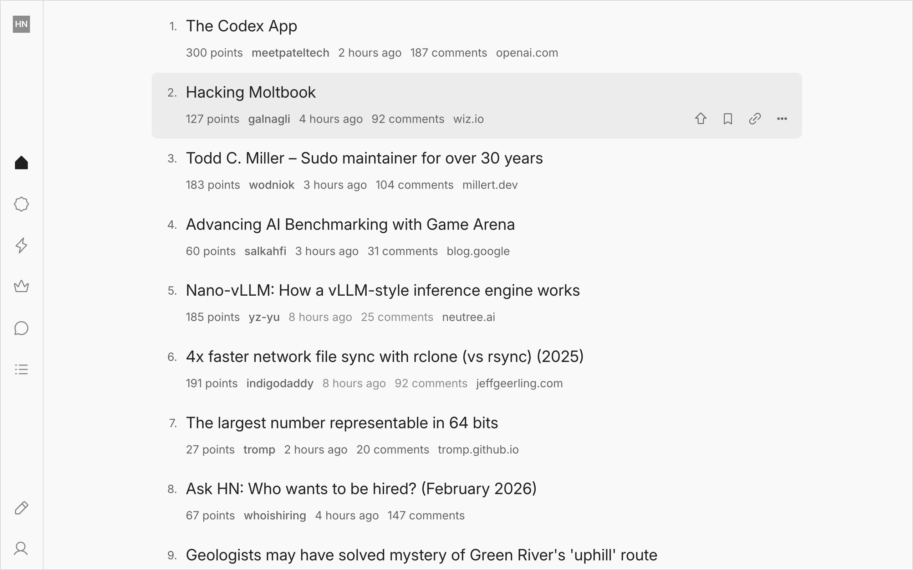

# zen-hn

Zen HN is a Chrome extension that restyles Hacker News for a calmer, more readable experience.

## Features
- Random - Stumbleupon for HN. Selects a random post from the past.
- Color modes - Light, dark or sync with your system.
- Themes - Choose from more than 20 themes.

## Install

⚠️ Warning: This a work in progress.

- Download or clone this repo.
- Open `chrome://extensions` in Chrome.
- Enable Developer mode.
- Click "Load unpacked" and select the repo folder.
